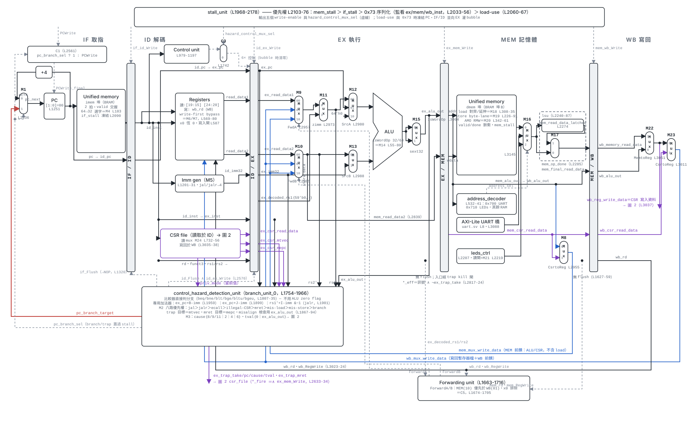
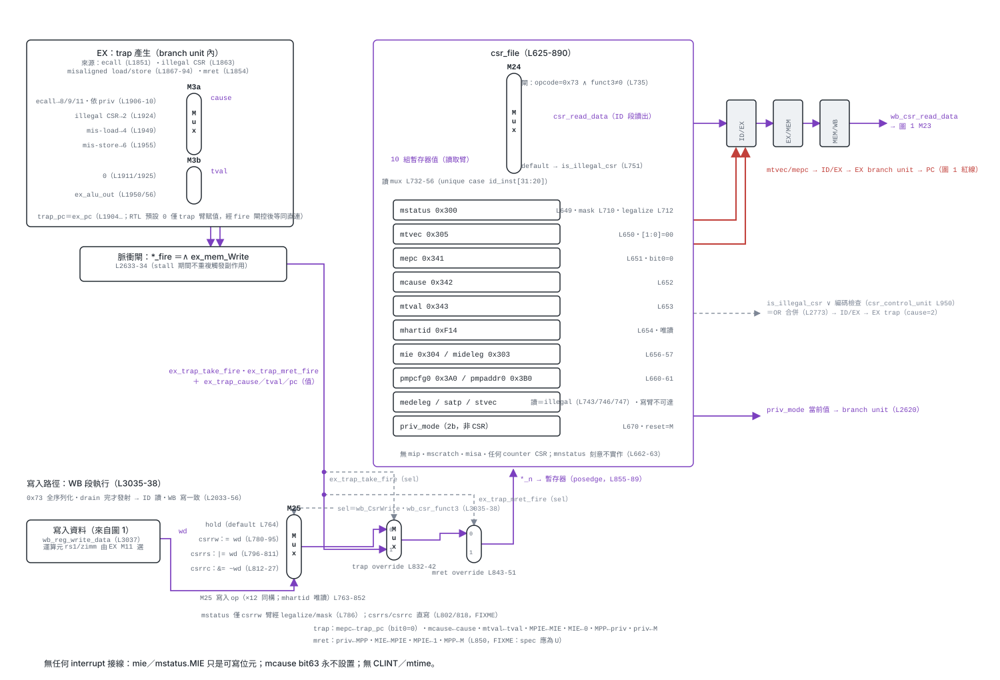

# RV64 RISC-V CPU / SoC

以 SystemVerilog 從零打造的 RV64 處理器：經典五級 in-order pipeline（IF／ID／EX／MEM／WB），支援 RV64I＋Zicsr＋amoadd 子集，含 forwarding、load-use stall、EX 級分支解析與 precise trap；SoC 端有 unified BRAM、AXI-Lite UART 與 LED MMIO，可跑模擬（Verilator／XSim／iverilog，與 Spike 逐字比對）也可燒進 FPGA。

## 五級管線資料通路

依 `rtl/cpu.sv` 逐行繪製，包含全部多工器與對應的 RTL 行號（點圖可放大）。

<a href="docs/img/datapath-pipeline-light.svg">
<picture>
  <source media="(prefers-color-scheme: dark)" srcset="docs/img/datapath-pipeline-dark.svg">
  
</picture>
</a>

圖例：黑＝主資料路（64b）・藍＝前饋／寫回迴路・紅＝branch/trap 重導・紫＝CSR 資料・灰虛線＝控制訊號・●＝接點（交叉無點＝不相連）

## CSR file 與 trap／mret 資料通路

<a href="docs/img/datapath-csr-light.svg">
<picture>
  <source media="(prefers-color-scheme: dark)" srcset="docs/img/datapath-csr-dark.svg">
  
</picture>
</a>

CSR 讀於 ID、寫於 WB，一致性由 SYSTEM（0x73）指令全序列化保證。

## 更多資訊

- 測試流程與開發環境說明：[docs/README.md](docs/README.md)
- 資料通路圖可列印版（A3 橫式 4 頁、向量輸出，含多工器總表）：[docs/datapath-a3.pdf](docs/datapath-a3.pdf)
- 快速回歸測試：`make spike-selftests`
